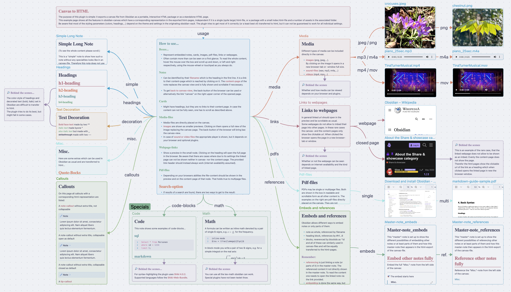
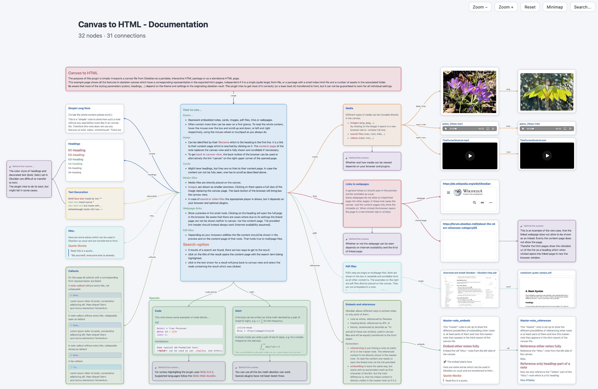

# Canvas to HTML

Export your Obsidian canvas as an interactive HTML page that can be opened in any modern browser.

The canvas showing the documentation of this plugin, seen in Obsidian...


looks (nearly) the same in the exported interactive HTML page...


The plugin supports two export formats:

- `Package folder`: creates a portable folder containing `index.html`, copied assets, and optional HTML subpages
- `Single HTML file`: creates one self-contained HTML document with inline assets and virtual subpages

You can choose the export format and other options in the plugin settings.

The **full documentation** shown above is available as [single HTML documentation](documentation/Canvas-to-HTML-Documentation.html).
Note that this is a large file of nearly 20 MB.

A **demo-vault** with the full documentation can be downloaded from the `examples/demo-vault` folder.

## Features

- Export the active `.canvas` file as an interactive HTML package or a single self-contained HTML file
- Preserve canvas layout, node styling, groups, connection labels, line styles, and markers
- Render text nodes and Markdown file nodes with Markdown formatting
- Show Markdown file nodes with a preview and export them as standalone HTML pages or embedded single-file pages
- Rewrite internal Markdown links, wiki links, heading links, section embeds, and block references
- Copy assets into package exports or inline them into single HTML exports
- Support image, PDF, audio, video, and generic file nodes
- Render LaTeX math with KaTeX
- Highlight fenced code blocks with Shiki and selectable themes
- Support link nodes with preview pages and offline/blocking fallbacks
- Include zoom controls, optional minimap, and optional search overlay
- Preserve light/dark mode and selected Obsidian theme colors where possible

## Supported Content

Canvas nodes:
- text nodes
- group nodes
- link nodes
- Markdown file nodes
- image, PDF, audio, video, and generic file nodes

Markdown content:
- headings, lists, tables, blockquotes, callouts, code fences, and horizontal rules
- LaTeX math
- internal links, wiki links, section links, embeds, and block references

## Export Formats

### Package folder
Each package export creates a dedicated folder inside the configured output directory (here: "Canvas-Exports"):

```text
Canvas-Exports/
  Canvas_Name/
    index.html
    assets/
      images/
      files/
```

Depending on the canvas contents, the export may also include additional HTML pages for Markdown and link nodes which will then reside in the files folder.

### Single HTML file

Single HTML exports create one file in the configured output location (here: "Canvas-Exports"):

```text
Canvas-Exports/
  Canvas_Name.html
```

Because assets are embedded, the file can grow to several MB for large canvases and/or many assets.

## How to Use

1. Open a canvas in Obsidian. The active file must be a `.canvas` file.
2. Run the command `Export active canvas as HTML` from the command palette.
3. Open the generated export:
   - `index.html` for `Package folder`
   - `Canvas_Name.html` for `Single HTML file`

You can also use the ribbon icon to trigger the export.

## Demo-Vault

This repository includes a small demo vault with the full documentation in `examples/demo-vault`.

To use it:

1. Download this repository as a ZIP file from GitHub and extract it.
2. Open `examples/demo-vault` as a vault in Obsidian.
3. Install and enable **Canvas to HTML**:
   - from Obsidian Community Plugins once published, or
   - manually by copying `manifest.json` and `main.js` into `.obsidian/plugins/canvas2html/`.
4. Open the plugin settings and choose the export format and output folder.
5. Open `documentation/Canvas to HTML - Documentation.canvas`.
6. Run `Export active canvas as HTML`.

## Installation

Install from Obsidian Community Plugins once published, or copy manifest.json and main.js into your vault plugin folder. There is no styles.css file.

## Plugin Settings

- `Export format`: export as package or single HTML file
- `Dark default theme`: use a dark default theme for exported HTML
- `Show minimap`: include a minimap on the exported canvas page
- `Show search`: include a search overlay on the exported canvas page
- `Syntax highlighting`: choose the Shiki theme family for code blocks
- `Output folder`: choose a folder inside the vault or an absolute filesystem folder on desktop

## Notes and Limitations

- External websites may refuse to load inside an embedded frame because of their own security headers.
- Exported HTML is designed to be portable, but remote website previews still need an internet connection.
- The plugin is desktop-only because exports can use local filesystem access and desktop folder selection.
- `Single HTML file` is convenient for sharing, but very large canvases and/or many embedded files can make the output file quite large.
- Browser behavior around very large inline assets, PDF rendering, and history can vary more in `Single HTML file` mode than in the `Package folder` export.
  Remember the presentation of the HTML files and their content always depends on the browser used and optional add-ons which may be installed in your system.
- Markdown rendering covers common Obsidian syntax, but plugin-specific Markdown extensions may not render exactly like they do inside Obsidian.

## Development
Install dependencies and run the checks:
```bash
npm install
npm test
npm run build
```

Development workflows:
```bash
npm run dev
npm run build:prod
```

To deploy a local development build directly into an Obsidian vault, set `OBSIDIAN_PLUGINS_DIR` and use one of the deploy scripts:
```bash
export OBSIDIAN_PLUGINS_DIR="/path/to/.obsidian/plugins"
npm run build:deploy
npm run dev:deploy
```

## License
**Canvas to HTML** is licensed under the GNU General Public License (GPL) v3.0 or later.
Exported HTML files and package folders generated by the plugin may be used, published, distributed, and licensed independently from the plugin under the output exception in the [LICENSE](LICENSE) file.

## Privacy and data handling
**Canvas to HTML** runs entirely locally on your computer and does not send data anywhere.

## Support
Please report bugs via the GitHub repository. I will try to respond to confirmed bugs and issues as quickly as possible.

If you enjoy the plugin and find it useful, you can support further development by buying me a coffee.
<a href='https://ko-fi.com/R5R2151DS7' target='_blank'></a>
