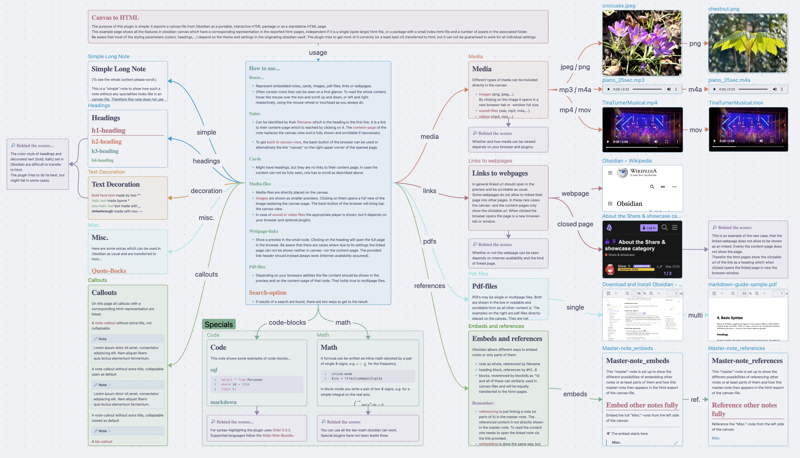
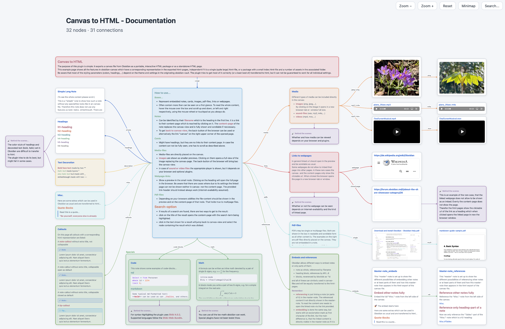

# Canvas HTML Exporter

Export your Obsidian canvas as an interactive HTML page that can be opened in any modern browser.

Requires Obsidian 1.13.0 or later.

If Canvas HTML Exporter is useful to you, you can support its continued
development by buying me a coffee.

<a href="https://ko-fi.com/R5R2151DS7" target="_blank"></a>

The canvas showing the documentation of this plugin, seen in Obsidian...


looks (nearly) the same in the exported interactive HTML page...


The plugin supports two export formats:

- `Package folder`: creates a portable folder containing `index.html`, copied assets, and optional HTML subpages
- `Single HTML file`: creates one self-contained HTML document with inline assets and virtual subpages

You can choose the export format and other options in the plugin settings.

An **interactive export example** of the Canvas shown above is available as a
[single HTML file](documentation/Canvas-HTML-Exporter-Documentation.html).
It is a large file of nearly 20 MB. This README contains the current feature
documentation.

A **demo-vault** with the complete content showcase can be downloaded from the
`examples/demo-vault` folder.

## Features

- Export the active `.canvas` file as an interactive HTML package or a single self-contained HTML file
- Preserve canvas layout, node styling, groups, connection labels, line styles, and markers
- Render text nodes and Markdown file nodes with Markdown formatting
- Show Markdown file nodes with a preview and export them as standalone HTML pages or embedded single-file pages
- Rewrite internal Markdown links, wiki links, heading links, section embeds, and block references
- Copy assets into package exports or inline them into single HTML exports
- Support image, PDF, audio, video, and generic file nodes
- Render LaTeX math with KaTeX
- Highlight fenced code blocks with Shiki and selectable themes
- Support link nodes with preview pages and offline/blocking fallbacks
- Include zoom controls, visibility-aware reset/fit, an optional minimap, and an optional search overlay
- Add interactive branch folding, level views, branch focus, and global folding actions to exported pages
- Optionally start the exported page with the current Canvas Folding state
- Keep folding available in exported HTML even when Canvas Folding is not installed
- Show hidden node and group counts separately in the exported page header
- Highlight selected search results with a strong yellow pulse
- Preserve light/dark mode and selected Obsidian theme colors where possible

## Interactive Canvas Controls

Every exported Canvas page keeps its original node positions and adds browser
controls above the Canvas:

- `Zoom −` and `Zoom +` change the current scale without moving nodes.
- `Reset` fits the currently relevant graph into the available browser area.
  Hidden nodes are excluded; while a branch is focused, the dimmed surrounding
  context is excluded as well. The fit calculation uses the actual remaining
  height below the toolbar, heading, and information line, including in short
  browser windows.
- `Minimap` shows the Canvas overview, hidden/focused state, and current
  viewport. It can be moved and used for navigation.
- `Search...` opens keyboard- and mouse-accessible node search. Selecting a
  result reveals it when necessary, scrolls it into view, and marks it briefly
  with a prominent yellow pulse highlight.

### Folding menu

Canvases with content nodes or an imported hidden state receive a `Folding`
menu:

- `No folding` expands the complete Canvas and hides node folding/focus
  controls. `Enable folding` turns the controls back on.
- `Expand all` reveals all branches.
- `Collapse all` collapses every rooted branch while safely handling multiple
  roots, shared descendants, cross-links, and cycles.
- `Level N` shows nodes through the selected shortest root level. Nodes in
  rootless directed cycles remain available rather than being assigned an
  arbitrary level.
- `Restore folding` restores the unchanged state imported during export. If no
  state was imported, it restores the initial fully expanded view. This action
  remains available even in `No folding` mode.
- `Exit focus` ends the active branch focus and deliberately appears last in
  the menu because it is a focus action rather than a folding action.

Every content node receives a focus control. Nodes with directed descendants
additionally receive a branch control:

- the `−`/`+` control collapses or expands that branch recursively;
- the focus icon shows the selected node and, when present, its descendants at
  full opacity while keeping the rest of the Canvas visible as context at 20%
  opacity. A node without children can therefore be focused on its own; `Reset`
  fits it to the available viewport. Selecting the same focus icon again exits
  focus.

Folding is non-destructive. It changes only the browser representation:
visible nodes retain their original positions, and the source `.canvas` file
is never changed. An edge and its label are hidden whenever at least one of its
endpoints is hidden. The information line reports hidden content nodes and
hidden Canvas groups separately.

## Optional Canvas Folding Integration

[Canvas Folding](https://github.com/HKohlhoff/canvas-folding) is an optional
companion plugin, not a dependency. In `Initial folding state`, choose:

- `Fully expanded` to keep the established exporter behavior;
- `Current Canvas Folding state` to start the exported page with the same
  folded branches that are currently shown in Obsidian.

If Canvas Folding is not available, export continues normally and the page
starts fully expanded.

The generated page is self-contained: its folding controls work in a normal
browser regardless of whether Canvas Folding is installed in the Obsidian
Vault that later opens or shares the export.

## One-Time Feature Update Description

After this feature update is loaded in Obsidian, the plugin opens a Markdown-
rendered `What's new` view once. It summarizes the new controls and how to use
them. Closing the view removes it completely; no release-note file is created
in the Vault.

The update description is shown only once and does not reappear on every
Obsidian start.

## Supported Content

Canvas nodes:
- text nodes
- group nodes
- link nodes
- Markdown file nodes
- image, PDF, audio, video, and generic file nodes

Markdown content:
- headings, lists, tables, blockquotes, callouts, code fences, and horizontal rules
- LaTeX math
- internal links, wiki links, section links, embeds, and block references

## Export Formats

### Package folder
Each package export creates a dedicated folder inside the configured output directory (here: "Canvas-Exports"):

```text
Canvas-Exports/
  Canvas_Name/
    index.html
    assets/
      images/
      files/
```

Depending on the canvas contents, the export may also include additional HTML pages for Markdown and link nodes which will then reside in the files folder.

### Single HTML file

Single HTML exports create one file in the configured output location (here: "Canvas-Exports"):

```text
Canvas-Exports/
  Canvas_Name.html
```

Because assets are embedded, the file can grow to several MB for large canvases and/or many assets.

## How to Use

1. Open a canvas in Obsidian. The active file must be a `.canvas` file.
2. Run the command `Export active canvas as HTML` from the command palette.
3. Open the generated export:
   - `index.html` for `Package folder`
   - `Canvas_Name.html` for `Single HTML file`
4. Use the node controls or the `Folding` menu to collapse branches, choose a
   level, focus a branch, restore the imported state, or disable folding.

You can also use the ribbon icon to trigger the export.

## Demo-Vault

This repository includes a small demo vault with the complete content showcase
in `examples/demo-vault`.

To use it:

1. Download this repository as a ZIP file from GitHub and extract it.
2. Open `examples/demo-vault` as a vault in Obsidian.
3. Install and enable **Canvas HTML Exporter**:
   - from Obsidian Community Plugins, or
   - manually by copying `manifest.json`, `main.js`, and `styles.css` into `.obsidian/plugins/canvas-html-exporter/`.
4. Open the plugin settings and choose the export format and output folder.
5. Open `documentation/Canvas HTML Exporter - Documentation.canvas`.
6. Run `Export active canvas as HTML`.

## Installation

Install from Obsidian Community Plugins, or copy `manifest.json`, `main.js`, and
`styles.css` into your Vault plugin folder.

## Plugin Settings

- `Export format`: export as package or single HTML file
- `Dark default theme`: use a dark default theme for exported HTML
- `Show minimap`: include a minimap on the exported canvas page
- `Show search`: include a search overlay on the exported canvas page
- `Initial folding state`: start fully expanded or import the current effective
  state from the optional Canvas Folding plugin
- `Syntax highlighting`: choose the Shiki theme family for code blocks
- `Output folder`: enter a folder inside the vault or an absolute filesystem folder on desktop
- `Choose vault folder`: browse for a folder inside the current vault
- `Choose system folder`: browse for an absolute filesystem folder

## Notes and Limitations

- External websites may refuse to load inside an embedded frame because of their own security headers.
- Exported HTML is designed to be portable, but remote website previews still need an internet connection.
- The plugin is desktop-only because exports can use local filesystem access and desktop folder selection.
- `Single HTML file` is convenient for sharing, but very large canvases and/or many embedded files can make the output file quite large.
- Browser behavior around very large inline assets, PDF rendering, and history can vary more in `Single HTML file` mode than in the `Package folder` export.
  Remember the presentation of the HTML files and their content always depends on the browser used and optional add-ons which may be installed in your system.
- Markdown rendering covers common Obsidian syntax, but plugin-specific Markdown extensions may not render exactly like they do inside Obsidian.
- Canvas is treated as a directed graph rather than assumed to be a strict
  tree. Multiple parents can keep a shared descendant visible through another
  expanded branch, and traversal of directed cycles is deterministic and
  finite.
- Folding version 1 uses stable layout. It does not compact or automatically
  rearrange the remaining visible nodes.

## Development
Install dependencies and run the checks:
```bash
npm ci
npm test
npm run build:prod
```

Development workflows:
```bash
npm run dev
npm run build:prod
```

To deploy a local development build directly into an Obsidian vault, set `OBSIDIAN_PLUGINS_DIR` and use one of the deploy scripts:
```bash
export OBSIDIAN_PLUGINS_DIR="/path/to/.obsidian/plugins"
npm run build:deploy
npm run dev:deploy
```

See [CONTRIBUTING.md](CONTRIBUTING.md) for the project structure and development
expectations. Release preparation is documented in
[docs/release-checklist.md](docs/release-checklist.md), and notable changes are
listed in [CHANGELOG.md](CHANGELOG.md).

## License
**Canvas HTML Exporter** is licensed under the GNU General Public License (GPL) v3.0 or later.
Exported HTML files and package folders generated by the plugin may be used, published, distributed, and licensed independently from the plugin under the output exception in [COPYING_EXCEPTION](COPYING_EXCEPTION).

## Privacy and data handling
**Canvas HTML Exporter** runs entirely locally on your computer and does not send data anywhere.

The plugin reads the active Canvas and its referenced local files to create the
export. It does not modify the source Canvas or source notes. Exported files are
created or updated only in the output folder you explicitly choose. If you
select an absolute folder outside the Vault, filesystem access is limited to
creating and updating the export and its assets in that folder.

The Ko-fi image in this README is documentation content and is not loaded or
contacted by the installed plugin.

The bundled plugin code may contain static-analysis matches for `fetch()`, `request()`, `atob()`, or `btoa()`. These are not used for network communication or obfuscation:
- `fetch()` and `request()` matches come from bundled syntax-highlighting and math-rendering dependencies, where they are internal parser or grammar terms.
- `atob()` and `btoa()` are used only for local asset handling in standalone HTML exports, where embedded files are represented as `data:` URLs and materialized as browser blobs.

## Support
Please report bugs via the GitHub repository. I will try to respond to confirmed bugs and issues as quickly as possible.
