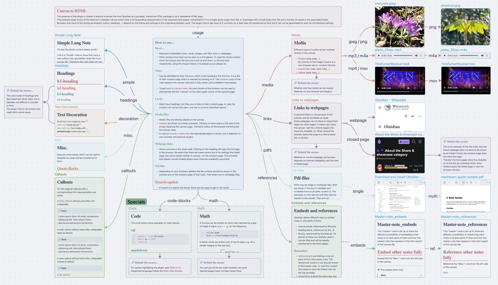
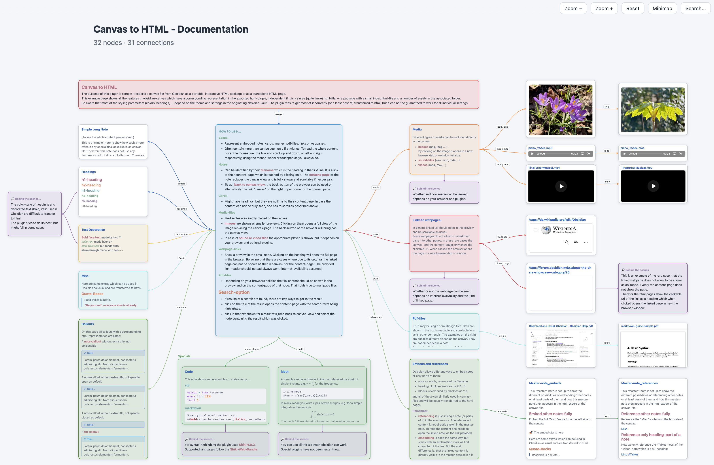

# Canvas HTML Exporter

Export your Obsidian canvas as an interactive HTML page that can be opened in any modern browser.

Requires Obsidian 1.13.0 or later.

## Tested platforms

The current plugin has been manually tested on:

- Windows 11;
- macOS.

The exported HTML was checked in current desktop browsers on those systems.
Advanced Canvas compatibility was additionally checked with the Standard,
Minimal, and AnuPpuccin themes.

If Canvas HTML Exporter is useful to you, you can support its continued
development by buying me a coffee.

<a href="https://ko-fi.com/R5R2151DS7" target="_blank"></a>

The canvas showing the documentation of this plugin, seen in Obsidian...


looks (nearly) the same in the exported interactive HTML page...


The plugin supports two export formats:

- `Package folder`: creates a portable folder containing `index.html`, copied
  assets, and optional HTML subpages. This is the recommended format for large
  or media-heavy Canvases because the browser opens a small HTML document and
  loads assets separately.
- `Single HTML file`: creates one self-contained HTML document with inline
  assets and virtual subpages. It is easiest to share as one file, but large
  embedded assets can delay initial browser interactivity.

You can choose the export format and other options in the plugin settings.

An **interactive export example** of the Canvas shown above is available as a
[single HTML file](documentation/Canvas-HTML-Exporter-Documentation.html).
It is a large file of about 19.3 MB and was refreshed for version 1.4.1.
This README contains the current feature documentation.

A **demo-vault** with the complete content showcase can be downloaded from the
`examples/demo-vault` folder.

## Features

- Export the active `.canvas` file as an interactive HTML package or a single self-contained HTML file
- Preserve canvas layout, node styling, groups, connection labels, line styles, and markers
- Preserve supported Advanced Canvas shapes, borders, text alignment, edge
  paths, edge heads, and saved colors
- Add independent collapse controls for Advanced Canvas groups in the exported
  page
- Render text nodes and Markdown file nodes with Markdown formatting
- Show Markdown file nodes with a preview and export them as standalone HTML pages or embedded single-file pages
- Follow linked Canvas file nodes and Canvas wiki links recursively, with cycle-safe navigation between overview and subcanvases
- Show linked Canvas cards with an offline diagram preview of their groups, nodes, colors, and connections
- Open a portable fixed Navigation panel with the Canvas hierarchy and the HTML pages directly contained in the current Canvas
- Rewrite internal Markdown links, wiki links, heading links, section embeds, and block references
- Copy assets into package exports or inline them into single HTML exports
- Support image, PDF, audio, video, and generic file nodes
- Render LaTeX math with KaTeX
- Highlight fenced code blocks with Shiki and selectable themes
- Support link nodes with preview pages and offline/blocking fallbacks
- Include zoom controls, visibility-aware reset/fit, an optional minimap, and an optional search overlay
- Add interactive branch folding, level views, branch focus, and global folding actions to exported pages
- Optionally start the exported page with the current Canvas Folding state
- Keep folding available in exported HTML even when Canvas Folding is not installed
- Show hidden node and group counts separately in the exported page header
- Highlight selected search results with a strong yellow pulse
- Preserve light/dark mode and selected Obsidian theme colors where possible

## Interactive Canvas Controls

Every exported Canvas page keeps its original node positions and adds browser
controls above the Canvas:

- `Zoom −` and `Zoom +` change the current scale without moving nodes.
- Area zoom is always available: drag a rectangle with the left mouse button
  over a non-interactive part of the Canvas and release it to fit that area.
  A short click remains unchanged; press `Esc` to cancel the current drag.
- `Reset` fits the currently relevant graph into the available browser area.
  Hidden nodes are excluded; while a branch is focused, the dimmed surrounding
  context is excluded as well. The fit calculation uses the actual remaining
  height below the toolbar, heading, and information line, including in short
  browser windows.
- `Minimap` shows the Canvas overview, hidden/focused state, and current
  viewport. It can be moved and used for navigation.
- `Search...` opens keyboard- and mouse-accessible node search. Selecting a
  result reveals it when necessary, scrolls it into view, and marks it briefly
  with a prominent yellow pulse highlight. Tab and Shift+Tab stay inside
  the open search dialog; closing it returns focus to the control used to open
  it.

### Folding menu

Canvases with nodes or groups receive a `Folding` menu in every initial folding
mode:

- `No folding` expands the complete Canvas and hides node folding/focus
  controls. `Enable folding` turns the controls back on.
- `Hide/Show folding controls` changes only the visibility of the branch
  controls on nodes; the current folded state remains unchanged.
- `Expand all` reveals all branches and groups.
- `Collapse all` collapses every rooted branch while safely handling multiple
  roots, shared descendants, cross-links, and cycles.
- `Level N` shows nodes through the selected shortest root level. Nodes in
  rootless directed cycles remain available rather than being assigned an
  arbitrary level.
- `Restore folding` restores the unchanged state imported during export. If no
  state was imported, it restores the initial fully expanded view. This action
  remains available even in `No folding` mode.
- A separator introduces the focus section. `Hide/Show focus controls` changes
  the visibility of focus controls without ending an active focus.
- `Exit focus` ends the active branch focus and deliberately appears last in
  the menu because it is a focus action rather than a folding action.

Every node and group receives a focus control. Nodes and groups with directed
descendants additionally receive a branch control:

- the `−` control collapses that branch recursively. An expandable branch
  displays the number of its currently hidden descendant nodes instead of `+`;
  the focus control is hidden until the branch is expanded again, leaving the
  complete control area to the folding count. The control grows for
  multi-digit counts as needed.
  Shared descendants remain visible while they are still reachable through
  another open parent branch. In that case the collapsed branch connection is
  hidden, `+` remains, and its tooltip reports the hidden connections;
- if every descendant of a visible item is unavailable behind a folded group,
  its branch control stays in place but is disabled with **Branch hidden by
  folded group**. Expanding the group restores the control without changing
  that branch's previous state;
- the focus icon shows the selected node and, when present, its descendants at
  full opacity while keeping the rest of the Canvas visible as context at 20%
  opacity. Focusing a group also keeps every item geometrically contained by
  that group at full opacity. A node or empty group can therefore be focused on
  its own; `Reset` fits the focused area to the available viewport. Selecting
  the same focus icon again exits focus.

Folding is non-destructive. It changes only the browser representation:
visible nodes retain their original positions, and the source `.canvas` file
is never changed. An edge and its label are hidden whenever at least one of its
endpoints is hidden. The information line reports hidden content nodes and
hidden Canvas groups separately.

Connected groups follow their own directed branch. Folding a group also hides
nodes geometrically contained by it, even when those nodes have no separate
edge from the group. Folding a separate node branch inside that group hides
only that node branch and does not indirectly hide the connected group frame.

## Optional Canvas Folding Integration

[Canvas Folding](https://github.com/HKohlhoff/canvas-folding) is an optional
companion plugin, not a dependency. In the `Folding` setting, choose:

- `No folding` to start fully expanded with node folding/focus controls
  switched off; this is the default. The Folding menu remains available, and
  `Enable folding` activates the controls in the exported page;
- `Fully expanded` to include the controls while starting with every node
  visible;
- `Current Canvas Folding state` to start the exported page with the same
  folded branches that are currently shown in Obsidian.

If Canvas Folding is not available while `Current Canvas Folding state` is
selected, export continues normally and the page starts fully expanded with
browser folding controls.

The generated page is self-contained: its folding controls work in a normal
browser regardless of whether Canvas Folding is installed in the Obsidian
Vault that later opens or shares the export.

## Update Description

After a new plugin version is loaded in Obsidian, the plugin opens a Markdown-
rendered `What's new` view once. It summarizes the new controls and how to use
them. Closing the view removes it completely; no release-note file is created
in the Vault.

The update description is marked as read only after you close it. It is shown
once per plugin version, including maintenance updates, and does not reappear
on every Obsidian start. Use **Show last update** at the bottom of the plugin settings to
open it again at any time. Use **Show readme** beside it to open this complete
documentation locally inside Obsidian. The repository keeps the same text in
[`Last Update.md`](Last%20Update.md).

## Supported Content

Canvas nodes:
- text nodes
- group nodes
- link nodes
- Canvas file nodes
- Markdown file nodes
- image, PDF, audio, video, and generic file nodes

Markdown content:
- headings, lists, tables, blockquotes, callouts, code fences, and horizontal rules
- LaTeX math
- internal links, wiki links, section links, embeds, and block references

### Advanced Canvas compatibility

Canvas HTML Exporter reads supported Advanced Canvas attributes directly from
the saved `.canvas` file. Advanced Canvas does not need to be installed or
enabled when you export or view the generated HTML. Disabling Advanced Canvas
does not remove these stored attributes. Standard Obsidian does not render all
of them, so the generated HTML can intentionally retain an Advanced Canvas
appearance that is not currently visible in Obsidian.

The exporter preserves the built-in node shapes, border styles, text
alignment, edge path styles, edge heads, the six numbered Canvas palette
colors, and custom colors. For items without an explicitly saved color, it
samples the active Canvas appearance at export time. Theme CSS, Style Settings
values, and active CSS snippets can therefore influence the exported default
edge color.

Every Canvas group receives its own browser control directly to the right of
the group name, including empty groups. Collapsing a group reduces its active
bounds to that compact title row and hides its frame and geometrically
contained content. Connected edges therefore remain attached to the visible
group label without a separate edge-routing exception. Nested groups, search,
minimap, fit/reset, restore, and the normal Canvas Folding controls continue to
work with this separate group state.

Open
[`Advanced Canvas Attributes.canvas`](examples/demo-vault/Advanced%20Canvas%20Attributes.canvas)
from the included demo vault to see the supported visual attributes and group
behavior in one self-contained example.

### Linked subcanvases

Canvas file nodes and Markdown or wiki links whose target is another `.canvas`
file are exported recursively. Clicking a Canvas card opens the linked Canvas
with the same layout and interactive controls as the overview. Each card shows
a lightweight diagram preview derived from the target Canvas geometry,
including groups, nodes, saved colors, and connections. The title and preview
form one clickable area; no separate action label is needed. In a linked Canvas,
the **(back to: Canvas)** label follows the node, group, connection, and
hidden-item counts in the same status row with a 20 px gap; only **Canvas** is
linked and returns to the overview with one click. A source Canvas file
card that points straight back to the overview is
omitted from the exported subcanvas because this control already provides that
navigation; the source `.canvas` file remains unchanged.

The exporter identifies each referenced Canvas by its Vault path. Shared
subcanvases are exported once, and references that form a cycle remain finite
and navigable. In a package, linked Canvases become real HTML pages beside
`index.html`. In a single HTML export, they become virtual pages inside the one
file. Embedded single-HTML Canvases use the full page like the overview rather
than appearing inside a page card. Package and single-HTML subcanvases place the same **(back to: Canvas)**
label immediately after those status details. Browser Back continues to follow
the navigation history.

If a linked Canvas cannot be parsed, the normal generic-file fallback is used
for that target and the rest of the export continues.

### Exported page navigation

Use **Navigation** in the Canvas toolbar to open a fixed panel on the
left. The current page remains visible beside it and returns to the full width
when the panel is closed. The
**Canvases** section shows the overview and recursively linked subcanvases as a
finite hierarchy; shared targets and cycles are listed only once, and the
current Canvas is highlighted. **Pages in this canvas** lists the Markdown,
PDF-viewer, and link-node HTML pages directly represented by cards in the
current Canvas. Selecting an entry opens the same portable target used by its
Canvas card. These file pages also provide the **Navigation** toggle in the same
plain-link style as **Back** and **Canvas**, plus the full panel. The highlight
follows the opened file page and returns to its owning Canvas when that page is
closed.

The drawer uses real relative links in a package and virtual page links in a
single HTML export. Each embedded subcanvas keeps its own local page list, so
its Markdown and other HTML pages open inside the correct embedded page scope.
Click **Navigation** again to close the panel, just like the Minimap control.

The plugin setting **Navigation** chooses whether this panel starts open or
closed. Opening or closing it on the main Canvas changes the default for Canvas
pages without an individual choice. Every Canvas and file page remembers its
own later open/closed state and restores it when reopened. Markdown, PDF, and
link pages start with Navigation closed on their first visit in either export
format, regardless of the global default; users can open it there and that
local choice is remembered. Package navigation also restores each Canvas's
zoom level and visible position when returning from another page.

HTML pages opened from a linked subcanvas show **Back** and **Canvas** together.
**Back** returns to the owning subcanvas, while **Canvas** returns directly to
the main overview. Pages opened from the main overview keep the single
**Canvas** link because both destinations would otherwise be identical.

## Export Formats

### Package folder
Each package export creates a dedicated folder inside the configured output directory (here: "Canvas-Exports"):

```text
Canvas-Exports/
  Canvas_Name/
    index.html
    canvas-001-Linked_Canvas.html
    assets/
      images/
      files/
```

Depending on the Canvas contents, the export may also include linked Canvas
pages beside `index.html` and additional HTML pages for Markdown and link nodes
inside the files folder.

For large or media-heavy Canvases, this is usually the better-performing
format. Keep the complete package folder together when moving, publishing, or
sharing it. As a concrete example, the documentation Canvas used during
development produced a package `index.html` of about 252 KB, while the
equivalent single HTML file was about 19.3 MB. Actual sizes depend on the Canvas
and its embedded assets.

Obsidian can hide generated `.html` files in its file tree even though the
export completed successfully and the files are present on disk. Enable
**Obsidian Settings → Files and links → Detect all file extensions** for the
current Vault when you want `index.html` and single HTML exports to appear in
Obsidian's file tree. This is an Obsidian Vault setting, not a Canvas HTML
Exporter setting, and can therefore differ between Vaults.

### Single HTML file

Single HTML exports create one file in the configured output location (here: "Canvas-Exports"):

```text
Canvas-Exports/
  Canvas_Name.html
```

Because assets are embedded, the file can grow to several MB for large canvases and/or many assets.
Linked subcanvases and their local assets are embedded in the same file as
virtual pages.
The browser must parse the embedded content before the page becomes fully
interactive, so initial controls may respond later than in a package export.
If quick startup matters more than distributing one file, use `Package folder`.

## How to Use

1. Open a canvas in Obsidian. The active file must be a `.canvas` file.
2. Run the command `Export active canvas as HTML` from the command palette.
3. Open the generated export:
   - `index.html` for `Package folder`
   - `Canvas_Name.html` for `Single HTML file`
4. Use the `Folding` menu to enable or disable node controls, collapse branches,
   choose a level, focus a branch, or restore the imported state.
5. Use `Navigation` to move between the Canvas overview, linked subcanvases, and
   HTML pages directly contained in the current Canvas.

You can also use the ribbon icon to trigger the export.

For a quick tour of the Advanced Canvas support, open `Advanced Canvas
Attributes.canvas` in the included demo vault and export it once in either
format. The Canvas contains the supported shapes, borders, alignments, colors,
edge paths, edge heads, and nested groups.

## Demo-Vault

This repository includes a small demo vault with the complete content showcase
in `examples/demo-vault`.

To use it:

1. Download this repository as a ZIP file from GitHub and extract it.
2. Open `examples/demo-vault` as a vault in Obsidian.
3. Install and enable **Canvas HTML Exporter**:
   - from Obsidian Community Plugins, or
   - manually by copying `manifest.json`, `main.js`, and `styles.css` into `.obsidian/plugins/canvas-html-exporter/`.
4. Open the plugin settings and choose the export format and output folder.
5. Open one of the included examples:
   - `documentation/Canvas HTML Exporter - Documentation.canvas` for the full
     content showcase;
   - `Advanced Canvas Attributes.canvas` for the supported Advanced Canvas
     appearance and interactive group behavior.
6. Run `Export active canvas as HTML`.

## Installation

Install from Obsidian Community Plugins, or copy `manifest.json`, `main.js`, and
`styles.css` into your Vault plugin folder.

## Plugin Settings

- `Export format`: use a package for faster startup on large or media-heavy
  Canvases, or a single HTML file for easier one-file sharing
- `Dark default theme`: use a dark default theme for exported HTML
- `Show minimap`: include a minimap on the exported canvas page
- `Show search`: include a search overlay on the exported canvas page
- `Folding`: start with folding switched off (default), start enabled with a
  fully expanded Canvas, or import the current effective state from the
  optional Canvas Folding plugin; folding can still be switched on or off at
  any time in the exported HTML
- `Syntax highlighting`: choose the Shiki theme family for code blocks
- `Output folder`: enter a folder inside the vault or an absolute filesystem folder on desktop
- `Choose vault folder`: browse for a folder inside the current vault
- `Choose system folder`: browse for an absolute filesystem folder

## Notes and Limitations

- External websites may refuse to load inside an embedded frame because of their own security headers.
- Exported HTML is designed to be portable, but remote website previews still need an internet connection.
- The plugin is desktop-only because exports can use local filesystem access and desktop folder selection.
- `Single HTML file` is convenient for sharing, but very large canvases,
  recursively linked subcanvases, and/or many embedded files can make the
  output file quite large.
- Browser behavior around very large inline assets, PDF rendering, and history can vary more in `Single HTML file` mode than in the `Package folder` export.
  Remember the presentation of the HTML files and their content always depends on the browser used and optional add-ons which may be installed in your system.
- Markdown rendering covers common Obsidian syntax, but plugin-specific Markdown extensions may not render exactly like they do inside Obsidian.
- Canvas is treated as a directed graph rather than assumed to be a strict
  tree. Multiple parents can keep a shared descendant visible through another
  expanded branch, and traversal of directed cycles is deterministic and
  finite.
- Folding version 1 uses stable layout. It does not compact or automatically
  rearrange the remaining visible nodes.
- Advanced Canvas floating edges, portals, presentation mode, custom CSS
  styles, and the `direct`, `square`, and `a-star` pathfinding modes are not
  reproduced by this compatibility layer.

## Development
Install dependencies and run the checks:
```bash
npm ci
npm test
npm run build:prod
```

Development workflows:
```bash
npm run dev
npm run build:prod
```

To deploy a local development build directly into an Obsidian vault, set `OBSIDIAN_PLUGINS_DIR` and use one of the deploy scripts:
```bash
export OBSIDIAN_PLUGINS_DIR="/path/to/.obsidian/plugins"
npm run build:deploy
npm run dev:deploy
```

See [CONTRIBUTING.md](CONTRIBUTING.md) for the project structure and development
expectations. Release preparation is documented in
[docs/release-checklist.md](docs/release-checklist.md), and notable changes are
listed in [CHANGELOG.md](CHANGELOG.md).

## License
**Canvas HTML Exporter** is licensed under the GNU General Public License (GPL) v3.0 or later.
Exported HTML files and package folders generated by the plugin may be used, published, distributed, and licensed independently from the plugin under the output exception in [COPYING_EXCEPTION](COPYING_EXCEPTION).

## Privacy and data handling
**Canvas HTML Exporter** runs entirely locally on your computer and does not send data anywhere.

The plugin reads the active Canvas, recursively linked local Canvases, and
their referenced local files to create the export. It does not modify the
source Canvases or source notes. Exported files are
created or updated only in the output folder you explicitly choose. If you
select an absolute folder outside the Vault, filesystem access is limited to
creating and updating the export and its assets in that folder.

The Ko-fi image in this README is documentation content and is not loaded or
contacted by the installed plugin.

The bundled plugin code may contain static-analysis matches for `fetch()`, `request()`, `atob()`, or `btoa()`. These are not used for network communication or obfuscation:
- `fetch()` and `request()` matches come from bundled syntax-highlighting and math-rendering dependencies, where they are internal parser or grammar terms.
- `atob()` and `btoa()` are used only for local asset handling in standalone HTML exports, where embedded files are represented as `data:` URLs and materialized as browser blobs.

## Support
Please report bugs via the GitHub repository. I will try to respond to confirmed bugs and issues as quickly as possible.
